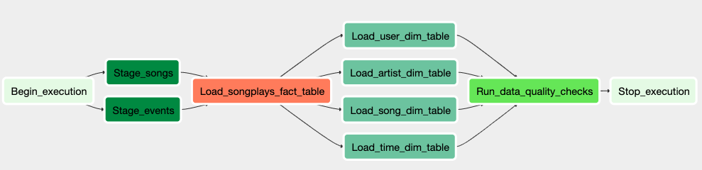

# Airflow-powered ETL pipeline for a Redshift data warehouse
Solarized dark             |  Solarized Ocean
:-------------------------:|:-------------------------:
  

## Overview

This is an ETL pipeline that extracts log data from AWS S3, stages it in AWS Redshift, and transforms it into dimensional tables for further data analysis. For easier maintenance, it is built from reusable tasks, can be monitored, and allow easy backfills. This pipeline is an extention to this [project](https://github.com/leolian003/Redshift-ETLandDW).

## Project Background
As requested by a hypothetical music streaming service startup, Sparkify, we are asked to build an ETL pipeline for its activity log and song metadata that resides in S3 in a json format. The outcome of this pipeline is a data warehouse with 4 dimensional tables and 1 fact table. 

## Project Goal 

Build an easy-to-maintain ETL pipeline that is run at regular interval to take care of new incoming data. It also allows easy backfills to support BI on historical data. 

## Getting started

### Database setup

1. Create a redshift cluster based on the step 1 - step 5 of this [guide](https://docs.aws.amazon.com/redshift/latest/gsg/getting-started.html).

   Some reasonable configuration: 
   * node type: "dc2.large"
   * cluster type: "multi-node"
   * number of nodes: 4

2. Based on the redshift metadata, fill the open fields in the dwh.cfg under `/instantiate-database`. 
   * (Host)Endpoint that hosts the cluster: *.REGION.redshift.amazonaws.com
   * Redshift IAM Role's ARN: arn:aws:iam::*:role/*
   * Database Name
   * Database User Name
   * Access Password
   * Database PORT (eg. 5439)

3. Execute `instantiate-database/create_tables.py`.

### Airflow configs setup

1. To initial metadata database, launch Airflow web UI and Airflow scheduler, follow steps suggested in this [guideline](https://airflow.apache.org/docs/stable/start.html). 

2. Set up connections and hooks: 
   * on Airflow web UI, Click on the Admin tab and select Connections.
   * On the create connection page, enter the following values:
       * Conn Id: Enter aws_credentials.
       * Conn Type: Enter Amazon Web Services.
       * Login: Enter your Access key ID from the IAM User credentials you downloaded earlier.
       * Password: Enter your Secret access key from the IAM User credentials you downloaded earlier.
   * Once you've entered these values, select `Save and Add Another`.
   * On the next create connection page, enter the following values:
       * Conn Id: Enter `redshift`.
       * Conn Type: Enter `Postgres`.
       * Host: Enter the endpoint of your Redshift cluster, excluding the port at the end. 
       * Schema: Enter your Redshift database name. This is the Redshift database you want to connect to.
       * Login: Enter your Redshift master user name.
       * Password: Enter the password you created when launching the Redshift cluster.
       * Port: Enter the port number you selected when launching the Redshift cluster.
   * click `Save`

### Launch the ETL workflow (DAG)

1. After `airflow` package is installed, copy `dag` folder in this repo to the `$AIRFLOW_HOME` directory (~/airflow by default in Mac os).
2. Go to `dag/ETL-redshiftDW-dag.pg`, in the first few lines,find code `sys.path.insert(1,'/PATH/CONTAINS/PLUGINS')`. Replace the `/PATH/CONTAINS/PLUGINS` with the absolute path that contains `plugins` folder in this repo. 
    * **This is a workaround, as for some reason Airflow cannot access my custom operators in the [normal way](https://airflow.apache.org/docs/stable/howto/custom-operator.html). Will fix it in the next version.**
3. Go to airflow web UI and trigger DAG `ETL-redshiftDW`.

   Alternatively, turn on the DAG so that it will be triggered for each scheduled interval. (1 hr in this case)
   

4. Click on the dag to monitor the workflow process from a `tree view`. 

5. If a problem is raised, click on the color square corresponding to the failed task on the `tree view`, and then click on `View log` to debug.

## ETL structure

The best part of this workflow, compared to the [previous version](https://github.com/leolian003/Redshift-ETLandDW), is that it is built from the reusable and parametrized blocks. For instance, staging the songs dataset / logs dataset in Redshift are two separate tasks in the previous version. In this version, however, they can be handled by one dag operator with different parameter values. The upside of this abstraction is to reduce code redundancy and increase reusability.

## 

 

